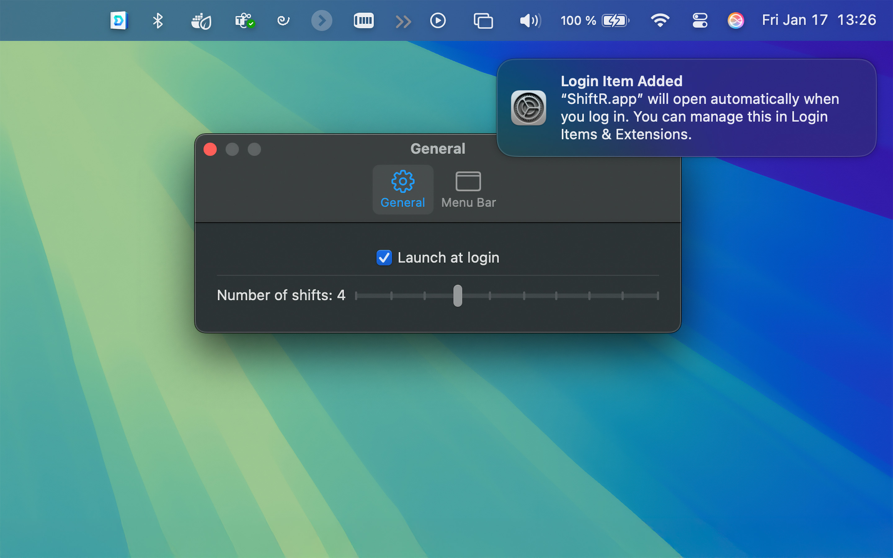
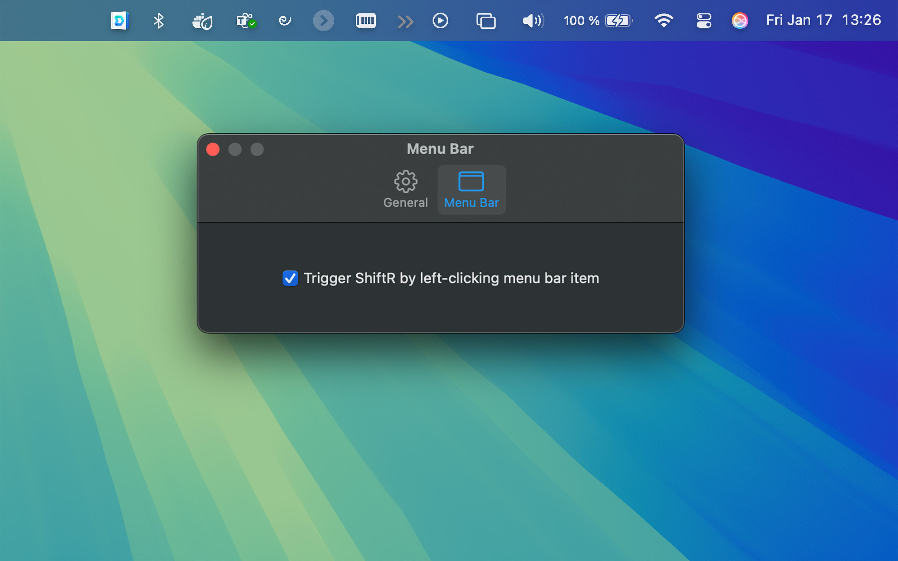

Make your menu bar usable again!

Stop playing hide-and-seek with your menu bar. If you’re rocking a smaller screen (or one of those beautiful MacBooks with a notch), your menu bar gets crowded quickly. macOS tries its best to manage this space, but often it means your favorite apps get shoved into the shadows. Quitting other menu bar apps might temporarily free up space, but it’s a clunky workaround. And honestly, why should you have to choose between your favorite apps and a usable menu bar?

ShiftR lets you cycle through overflowing menu bar items with a simple click. Hold the Command key and drag the ShiftR “>>” menu bar icon to your preferred position. When right-clicked, it shifts items on the left to the right, making them accessible. Click the icon to open the settings menu and customize how many items shift with each click, as well as enable triggering ShiftR with a left-click.
