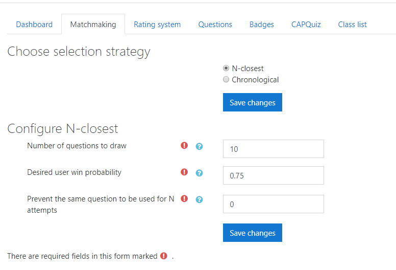

CAPQuiz is an adaptive learning system, which will continuously select questions to match student ability.
It is based on a rating system, similar to the Elo system used in chess, where the student rating estimates the proficiency and the question rating estimates the difficulty.

