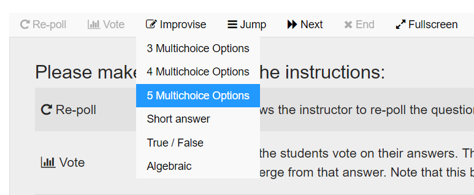

JazzQuiz is designed to be used in face-to-face lessons. The teacher may plan questions in advance, but can also easily improvise on the fly. Write your question on the blackboard, and select an appropriate question type from the dropdown menu. Several improvise questions will already be included: Short answer, multichoice (3, 4 & 5), true/false.

During the lesson, the teacher starts the quiz. Students can now connect to this quiz. Once the teacher is satisfied that all students have connected to the quiz, they can click on Start Quiz Depending on the question settings the question will end automatically, or will need to be ended via the instructor's End question button. The teacher can start a vote, with the selected responses, which students can answer.

The teacher can, at a later date, go back through the results and, for each question, see exactly what answer each student gave. The repolls are treated as separate questions, and you will get a correct order in the review page.

