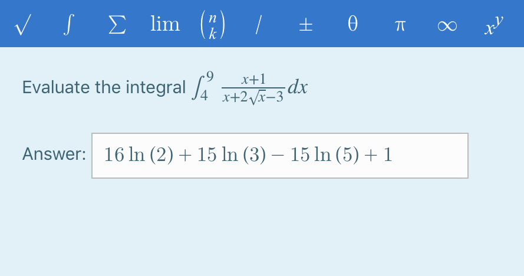

The plugin is based on the short answer question type, but the students enter their response in a maths editor. The student interface is WYSIWYG (what you see is what you get).

The editor interface is provided by MathQuill, which produces LaTeX code that is used as the internal representation. Rendering relies on MathJax which provides mathematically correct visual rendering.

ShortMath has been designed for use with JazzQuiz, where auto-grading is not used. However, if desired, auto-grading based on syntactic string match on the LaTeX code is supported.

